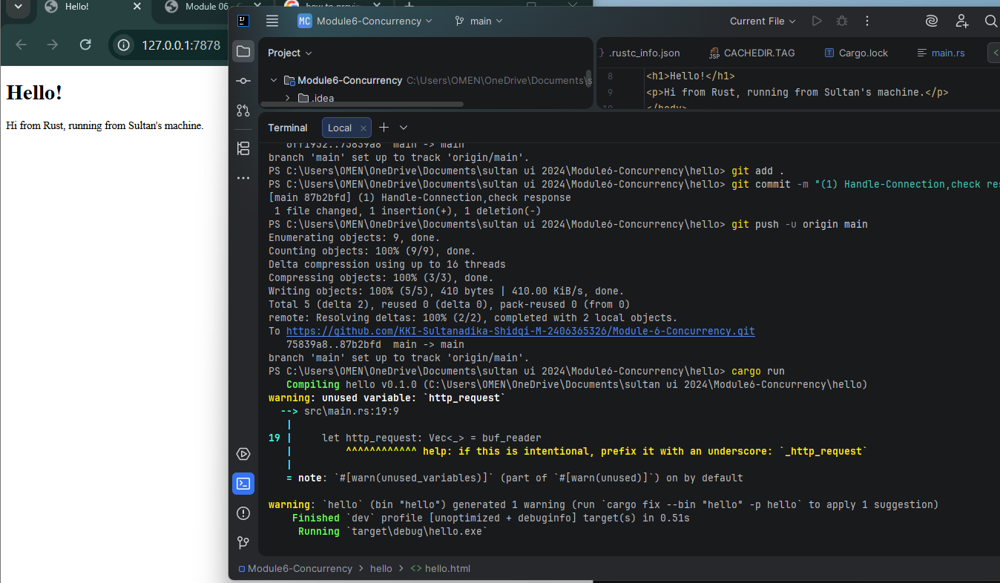
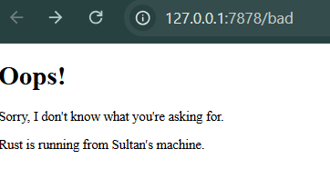
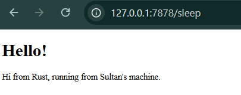

## Commit 1 Reflection Notes (Single Threaded Web Server)

So basically, the handle_connection function is used to deal with incoming connections from clients. It takes a TcpStream, which is like the connection between the server and the client where data is being sent.
Inside the function, we wrap the stream using BufReader so we can read the data more easily, especially line by line. Then we use .lines() to go through each line of the HTTP request sent by the client.
For each line, .map(|result| result.unwrap()) is used to get the actual string from the result. After that, .take_while(|line| !line.is_empty()) keeps reading lines until it hits an empty line. This is important because in HTTP, an empty line means the end of the request headers.
At the end, all the lines are stored in a vector and printed using println! with debug formatting, so we can clearly see what the request looks like in the terminal.
Overall, this function shows how a simple web server can read and understand incoming requests using Rust. It helped me understand things like how streams work, how buffering helps, and how HTTP requests are structured. 

## Commit 2 Reflection Notes:

## Commit 3 Reflection Notes:

In this part, I changed the server so it doesn’t always return the same page. Before, every URL just showed hello.html, which isn’t realistic.

Now I check the request line. If it’s GET / HTTP/1.1, I return hello.html with 200 OK. If not, I return a 404 NOT FOUND page.

This makes the server a bit smarter since it can respond differently based on the URL. I also understand better how HTTP requests work and how servers decide what to send back.

## Commit 4 Reflection Notes:

Added a /sleep route that makes the server wait for 10 seconds before responding. At first it felt like the website was broken, but actually it’s just delayed on purpose.

When I open /sleep, other requests also get delayed. This happens because the server handles requests one at a time, so everything gets blocked while it’s sleeping.

conclusion:  concurrency is important. Without it, one slow request can make the whole server unresponsive.

## Commit 5 Reflection Notes:

- Used a ThreadPool to make the server handle multiple requests at the same time. Before this, the server was single-threaded, so one slow request like /sleep would block everything.

- With ThreadPool, requests are assigned to different threads, so they can run in parallel. This makes the server faster and more responsive.

## Bonus Reflection Notes:

Changed the function from new to build. The main idea is that build returns a Result, so it can handle errors instead of assuming everything will always work.

For example, if the ThreadPool size is 0, it will return an error instead of creating something invalid. This makes the program safer and more reliable.

